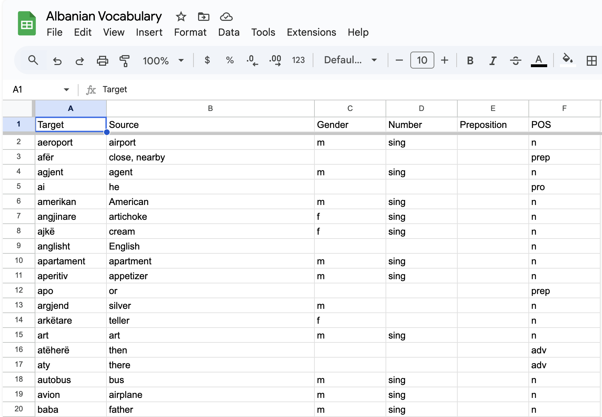

# Sheets2Anki

**Sheets2Anki** is an Anki add-on that synchronizes your Anki decks with a published Google Sheets CSV. Your Google Sheets document serves as the source of truth: when you sync, cards are created, updated, or removed in your Anki deck to reflect the sheet’s contents. This add-on is currently in **beta**, so features and behavior may still change.

## Features

- **Google Sheets as Source of Truth:**
  Your published Google Sheet determines the cards present in Anki.
- **Automatic Tag Assignment:**
  If you have a `tags` column in your sheet, those tags will be assigned to the cards in Anki.
- **Deck Maintenance:**
  - **Removed in Sheet → Removed in Anki:** If a card disappears from the sheet, it is removed from Anki on the next sync.
  - **Removed in Anki → Not Removed in Sheet:** There is **no reverse sync**. Deleting a card in Anki does not affect the sheet; the card may reappear if you sync again unless it’s removed from the sheet.
- **Dynamic Note Types:**
  - **Note Types:**
    - When adding a deck you can specify which note type to use. This allows you to have differently structured CSVs for different decks.
      - e.g. `Conjugation` note type has fields: `verb`, `tense`, `translation`, `1st person singular`, `2nd person singular`, `3rd person singular`, `1st person plural`, `2nd person plural`, `3rd person plural`. While `Vocabulary` note type has fields: `word`, `translation`, `example`, `example_translation`. These can be selected during the add deck process. **NOTE:** The fields in the note type must match the columns in the CSV.
- **Dynamic Key Fields:**
  - **Key Fields:**
    - You can specify one or more key fields to use as unique keys to check for remote decks. This allows you to create cards with similar keys such as if you have a `verb` and `tense` column, you can use both to create a unique key. So, you can have two cards that have `verb` as run and then `tense` as present and `tense` as past and that will allow two different cards.

**Important:** This add-on is in **beta**.

## No Reverse Sync & Deck Disconnection

- **No Reverse Sync:**
  All changes flow from Google Sheets to Anki. If you delete or modify a card in Anki, it will not update the sheet. To permanently remove a card, remove it from the sheet before syncing again.

- **Syncing vs. Disconnecting a Remote Deck:**
  - **Sync Once and Disconnect:**
    You can sync a deck once, and then if you prefer to manage cards locally without further remote updates, go to `Tools > Manage Remote Deck > Disconnect Remote Deck`. This "unlinks" Anki from the sheet. The local deck remains and can be edited freely in Anki as a normal deck.
  - **Continuous Syncing:**
    Alternatively, you can keep the deck connected and continue updating your Google Sheets document. Upon each sync, Anki updates to match the sheet. If you want a card gone, you must remove it from the sheet, as deletions in Anki alone won't persist after a resync.

## Example Google Sheets Document

- Create a Note Type in Anki with columns `Target`, `Source`, `Gender`, `Number`, `Preposition`, and `POS`.
- Create a google sheet with columns `Target`, `Source`, `Gender`, `Number`, `Preposition`, and `POS`.
- Add notes to the google sheet.
- After finalizing, publish the sheet as a CSV (File > Share > Publish to the Web), select as a `Link`, select `Comma-separated values`from the dropdown, publish, and copy the CSV URL.

## Installation

1. **Download the `.ankiaddon` File:**
   - Go to the [Releases](https://github.com/chrispooof/sheets2anki/releases) page of this repository.
   - Download the latest `.ankiaddon`.

2. **Install in Anki:**
   - In Anki, go to `Tools > Add-ons > Install from file...`.
   - Select the downloaded `.ankiaddon` file.
   - Restart Anki when prompted.

## Usage

1. **Add a New Remote Deck:**
   - `Tools > Manage Remote Deck > Add New Remote Deck`.
   - Paste the published CSV URL from your Google Sheet.
   - Enter a deck name and confirm.

2. **Sync Decks:**
   - `Tools > Manage Remote Deck > Sync Remote Decks` to update Anki from the sheet.

3. **Disconnect a Remote Deck:**
   - `Tools > Manage Remote Deck > Remove Remote Deck`.
   - This unlinks the remote sheet. The local deck remains, allowing you to manage it entirely in Anki going forward.

4. **Update Deck Key Fields:**
   - `Tools > Manage Remote Deck > Update Deck Key Fields`.
   - This updates the key fields for existing remote decks. The key(s) are used to check if a card already exists in Anki. If it does, it will update the card with the new data from the remote deck. If it doesn't, it will create a new card.

## Requirements

- **Anki Version:** Compatible with Anki 2.1.x.
- **Note Models Needed:**
  - **Basic:** Fields `Front` and `Back`.

Confirm these models exist before syncing.

## Troubleshooting

- **No Cards Imported?**
  Check CSV headers match the note type fields and ensure required note models exist.
- **Changes Not Updating?**
  Wait a few minutes after editing the sheet or verify the correct published CSV URL.
- **Cards Reappearing After Deletion in Anki?**
  Remember there’s no reverse sync. Remove the card from the sheet if you want it gone permanently.

## Beta Status and Future Plans

Sheets2Anki is in beta. Basic and Cloze types are supported now, but more features and improvements may follow as the project evolves. Keep an eye on this repository for updates.
